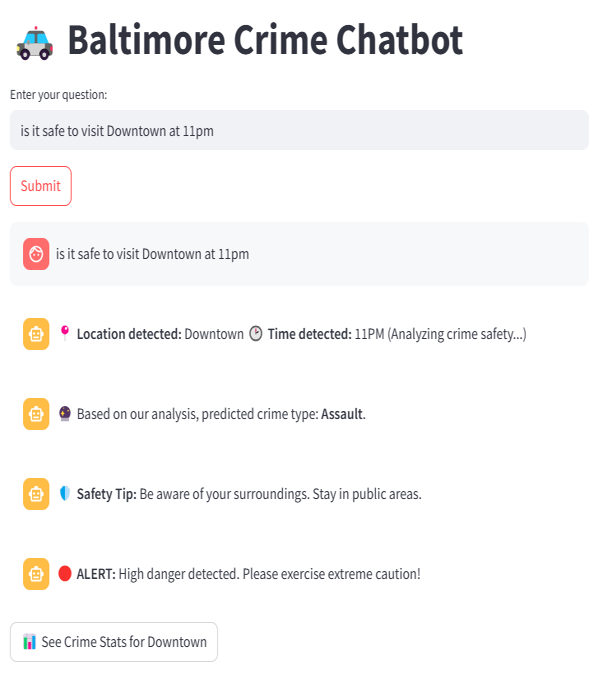
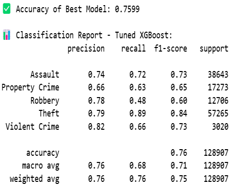
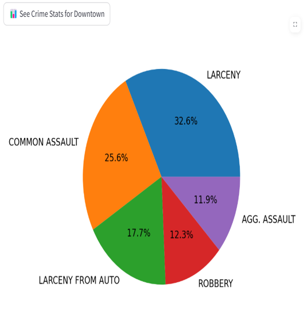
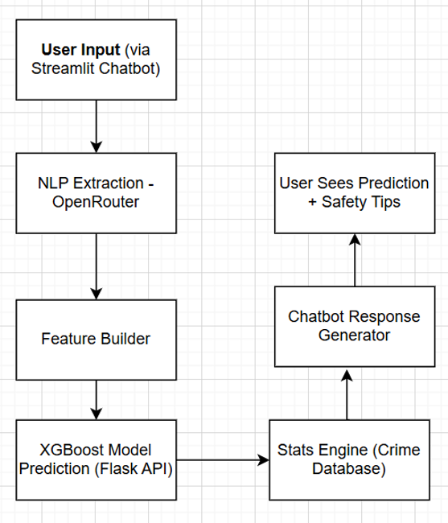

# 🧠 Building an AI-Powered Crime Prediction Chatbot: A Real-Time Public Safety Companion

## 🧭 Introduction

In an era where data and AI increasingly shape how cities operate, ensuring public safety through intelligent systems has become not just possible—but essential. This project presents the design and implementation of an AI-driven chatbot that predicts the **type of crime likely to occur based on location and time**, while also providing practical safety recommendations. Focused on Baltimore, the chatbot draws from historical crime data, weather conditions, and demographic indicators to deliver actionable...
**_"Is it safe to go to this area at this time?"_**



---

## 🎯 Project Objective

Traditional crime dashboards often present static, historical data that can be hard to interpret. This chatbot streamlines user interaction by:
- Accepting **natural-language queries**
- Extracting structured **location and time**
- Generating a **context-rich feature vector**
- Predicting the **most likely crime type**
- Delivering **safety tips** and **crime stats**

---

## 🧾 Data Collection and Feature Engineering

Three primary datasets were used:
- 🕵️‍♂️ **Baltimore Police crime records (2011–2024)**
- 🌦️ **NASA POWER weather reports**
- 🧑‍🏫 **Neighborhood demographic data - ACS 5-year**

---

## 🤖 Model Training and Performance (XGBoost)

### Training Process:
- Cleaned and merged datasets
- Encoded categorical features
- Applied `GridSearchCV` for tuning
- Used an 80/20 stratified split

### Performance:
- **Validation Accuracy**: `75.99%`
- Balanced macro F1-scores



---

### 🔧 Best Model Parameters

```python
XGBClassifier(
    subsample=0.8,
    n_estimators=300,
    min_child_weight=1,
    max_depth=10,
    learning_rate=0.1,
    gamma=1,
    colsample_bytree=0.6,
    objective='multi:softprob',
    eval_metric='mlogloss',
    use_label_encoder=False,
    random_state=42
)
```

---

### 💬 Streamlit Chat Interface

Users receive:
- 🟢 Predicted crime type
- 📍 Safety tip
- 📊 Pie chart of top crimes



---

### 🧱 Backend Architecture

The app runs through a modular Flask + Streamlit architecture.



---

## 🧩 Conclusion

The **Crime Prediction Chatbot** blends ML, NLP, and public datasets to support safer urban mobility through actionable insights.
